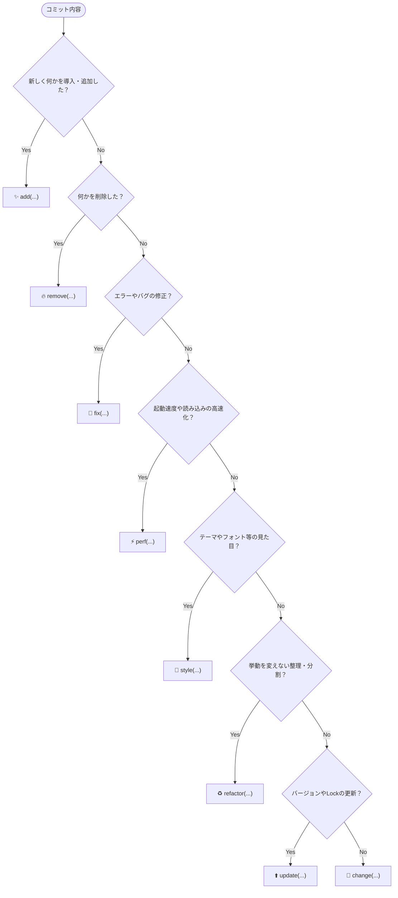

# Commit Message Guidelines for dotfiles

## 1. フォーマット

```text
<emoji> <type>(<scope>): <subject>
```

### 例
* `✨ add(nvim): flash.nvim を導入`
* `⚡️ perf(fish): プロンプトの git 状態取得を非同期化`

---

## 2. Type & Emoji 一覧

| 絵文字 | Gitmoji コード | Type | 用途 | コミット例 |
| :---: | :--- | :--- | :--- | :--- |
| ✨ | `:sparkles:` | **`add`** | プラグイン、新設定、キーマップ、エイリアス、関数の追加 | `✨ add(nvim): flash.nvim を導入` |
| 🔧 | `:wrench:` | **`change`** | 既存の設定値・オプションの変更、キーマップの差し替え | `🔧 change(fish): abbr の展開キーを space に変更` |
| 🔥 | `:fire:` | **`remove`** | 不要になった設定、プラグイン、関数の削除 | `🔥 remove(nvim): 使用頻度の低いプラグインを削除` |
| 🐛 | `:bug:` | **`fix`** | エラーの解消、壊れた設定、OS・バージョン差分の修正 | `🐛 fix(tmux): macOS でクリップボード共有が動かない問題を修正` |
| ⚡️ | `:zap:` | **`perf`** | 起動高速化、遅延読み込み（lazy load）、キャッシュ化などの改善 | `⚡️ perf(nvim): treesitter の遅延読み込みで起動を高速化` |
| 🎨 | `:art:` | **`style`** | カラースキーム、フォント、ステータスライン、プロンプト等の外見 | `🎨 style(starship): プロンプトのアイコンと配色を更新` |
| ♻️ | `:recycle:` | **`refactor`** | 設定ファイルの分割・モジュール化・整理（挙動自体は変えない） | `♻️ refactor(nvim): keymaps を別ファイルに切り出し` |
| ⬆️ | `:arrow_up:` | **`update`** | プラグインやパッケージのバージョン・Lock ファイル更新 | `⬆️ update(nvim): lazy-lock.json を更新` |
| 📦 | `:package:` | **`setup`** | chezmoi 設定、インストールスクリプト、Brewfile 等の変更 | `📦 setup: フォントインストールスクリプトを更新` |
| 📝 | `:memo:` | **`docs`** | README やドキュメント類の追加・修正 | `📝 docs: コミットガイドラインを追記` |

---

## 3. Scope の指定ルール

`scope` には設定変更を行った対象（ツール名やカテゴリ）を小文字で指定する。

* **エディタ・開発環境**: `nvim`, `tmux`, `git`, `ghostty`, `wezterm`, `kitty`, `vscode`
* **シェル・CLI ツール**: `fish`, `zsh`, `starship`, `eza`, `fzf`, `bat`, `yazi`
* **システム・環境管理**: `chezmoi`, `brew`, `mise`, `asdf`, `os`
* **全体・スコープ不要な場合**: スコープを省略して `<emoji> <type>: <subject>` とする

---

## 4. クイック判断フロー


